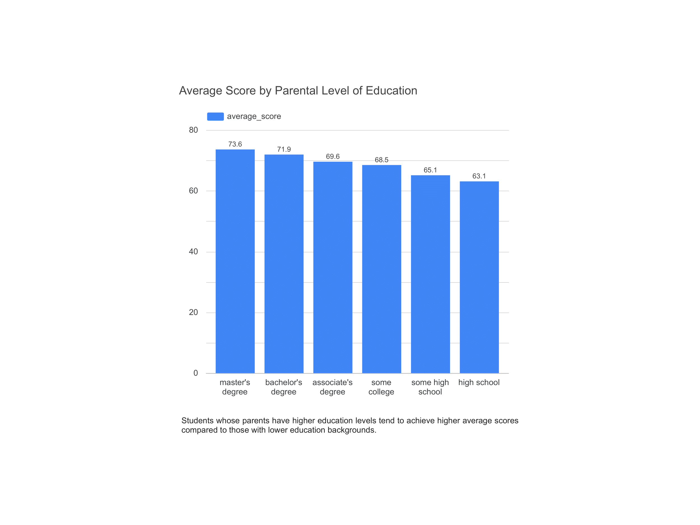

# Student Performance Dashboard - Diki Darmawan

## Overview
This project features an interactive dashboard visualizing key factors influencing student academic performance. The dashboard provides insights into how [translate:test preparation], [translate:parental education], and [translate:lunch/nutrition] affect student scores.

## Project Scope
- Analyze and visualize the impact of [translate:test preparation] on student performance.
- Display the correlation between parental education level and student achievement.
- Show the effect of lunch type on student learning outcomes.
- Provide actionable recommendations to improve academic results.

## Features
- Visual and interactive representation of student data.
- Clear insights and contextual explanations.
- Easily accessible dashboard design.

## Technology Stack
- Google Sheets: Data collection, cleaning, exploration, and analysis (including pivot tables).
- Google Looker Studio: Data visualization and dashboard creation.
- GitHub Pages: Hosting static project content.

## Data Analysis Methodology
The initial data was collected and processed using Google Sheets. The main steps were:
- Data cleaning: Removing duplicates, fixing input errors, and ensuring consistency.
- Data exploration: Examining distributions and identifying key variables with Google Sheets.
- Pivot tables: Used to group and summarize data based on categories such as [translate:test preparation], parental education level, and lunch type.
- The analyzed data was then visualized in the Looker Studio dashboard.

## Dashboard Visualization Description
The dashboard contains several key visualizations, such as:
- Bar charts comparing average student scores by parental education level.
- Scatter plots analyzing the relationship between parental education and academic performance.
- Column charts comparing student scores based on lunch type (standard vs free/reduced).
- Each visualization includes contextual explanations to help users interpret the data.

## Example Visualization
The following illustration shows an example chart displayed on the dashboard:

*Image: Average student scores by parental education level. Students with more educated parents tend to achieve higher average scores.*

## How to Access the Dashboard
View the live dashboard at:  
[https://dickydarmaa.github.io/student-performance-dashboard/](https://dickydarmaa.github.io/student-performance-dashboard/)

## Dashboard Usage Instructions
- Navigate each chart by using the menu or filters.
- Click categories to see detailed data.
- Accessible from desktop and mobile.
- Use the visual insights to understand key factors affecting student academic success.

## Insights from Data
- Students who completed test preparation courses scored 7.7 points higher on average.
- Students receiving standard lunch scored 8.6 points higher on average than those receiving free/reduced lunch.
- Higher parental education levels correlate with higher student scores.

## Recommendations
- Implement additional academic support programs.
- Strengthen collaboration programs with parents.
- Enhance nutrition programs to ensure quality meals for students.

## Project Date
Thursday, 30 October 2025

---

This dashboard was developed by Diki Darmawan as part of the RevoU data analysis curriculum.
