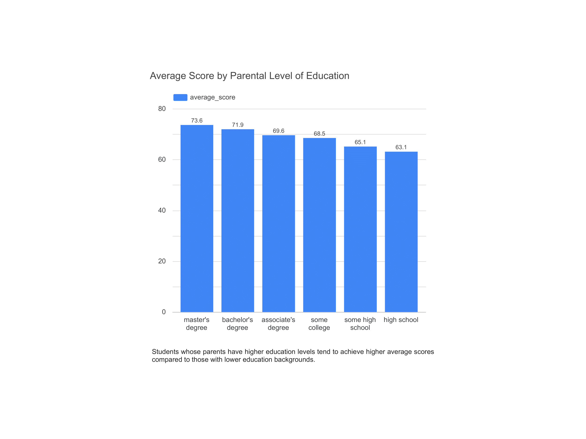
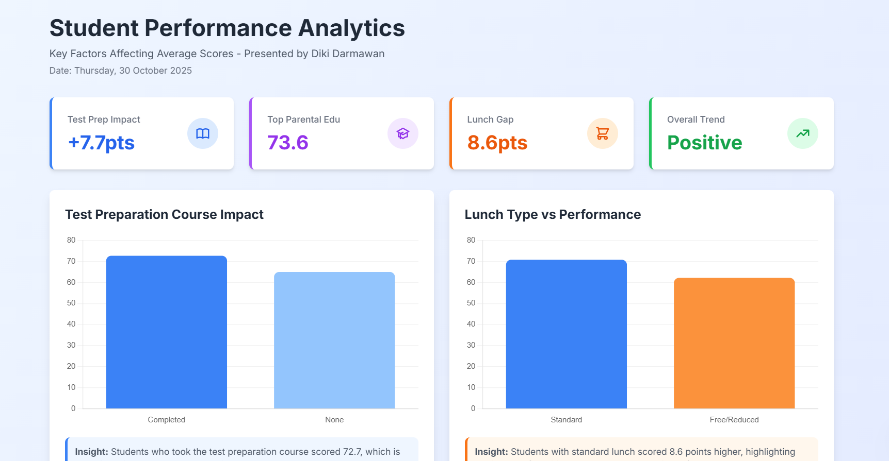

# 🎓 Student Performance Analysis Dashboard – Diki Darmawan

## 📘 Overview
This project presents an **interactive dashboard** that visualizes key factors influencing student academic performance.  
The dashboard provides insights into how **test preparation**, **parental education level**, and **lunch/nutrition type** impact students’ overall achievement and learning outcomes.

---

## 🎯 Project Scope
- Analyze and visualize the impact of **test preparation** programs on student scores.  
- Display the correlation between **parental education level** and academic performance.  
- Show the effect of **lunch/nutrition type** on learning outcomes.  
- Provide **actionable recommendations** to support educational improvement initiatives.

---

## ⚙️ Key Features
- Visual and interactive representation of student data.  
- Clear, contextual explanations accompanying each visualization.  
- Simple and **responsive dashboard design**, accessible on both desktop and mobile devices.  
- Structured layout for easy interpretation and comparison between academic factors.

---

## 🧰 Technology Stack
| Tool | Purpose |
|------|----------|
| **Google Sheets** | Data collection, cleaning, exploration, and analysis (including pivot tables) |
| **Google Looker Studio** | Data visualization and dashboard creation |
| **GitHub Pages** | Hosting for static dashboard deployment |

---

## 📊 Data Analysis Methodology
The dataset was collected and analyzed using **Google Sheets**, and visualized in **Google Looker Studio**.

### Steps:
1. **Data Cleaning:**  
   Removed duplicate entries, corrected input errors, and ensured dataset consistency.

2. **Data Exploration:**  
   Examined distributions and identified relationships between key variables such as parental education, test preparation, and lunch type.

3. **Pivot Tables:**  
   Created summaries and grouped data by categories:  
   - Test preparation status (completed / none)  
   - Parental education level  
   - Lunch type (standard / free or reduced)

4. **Visualization:**  
   The processed data was visualized in **Looker Studio**, using bar, column, and scatter plots to reveal patterns in student performance.

---

## 📈 Example Visualizations

### 📊 Average Score by Parental Education Level
Bar chart comparing average student scores by parental education level.  
Students whose parents have higher education levels tend to achieve higher average scores.

  

<em>Figure: Students with more educated parents demonstrate higher academic performance on average.</em>

---

## 💡 Insights from Data

| Factor | Observation |
|--------|--------------|
| **Test Preparation** | Students who completed test preparation courses scored **7.7 points higher on average**. |
| **Lunch/Nutrition Type** | Students receiving **standard lunch scored 8.6 points higher** than those on free/reduced lunch. |
| **Parental Education** | Higher parental education levels correlate with **better student scores** and overall performance. |

---

## 🧩 Recommendations
- **Enhance academic support programs** such as tutoring and test preparation initiatives.  
- **Encourage parent involvement** in student learning through collaborative education programs.  
- **Improve school nutrition programs** to ensure consistent, high-quality meals for all students.  

---

## 🧭 Interactive Dashboard

The interactive dashboard was developed using **Google Looker Studio**, designed to simplify the exploration of student performance data and relationships between influencing factors.

**Dashboard Features:**
- Comparison of average scores by parental education level  
- Analysis of test preparation impact  
- Correlation between lunch type and academic outcomes  
- Interactive filters for gender, education, and other variables  
- Responsive layout for easy access across devices  

  

<em>Figure: Interactive dashboard showing relationships between parental education, test preparation, and student scores.</em>

  

---

## 🎓 Project Information
- **Project Date:** Thursday, 30 October 2025  
- **Course / Context:** RevoU Data Analysis Curriculum  
- **Developed by:** Diki Darmawan
